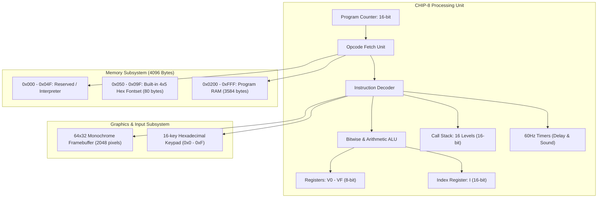
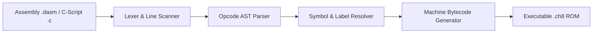

# Architecture & Technical Specification: DByte CHIP-8 SDK

This document provides a comprehensive technical overview of the virtual machine architecture, compiler internals, binary static analyzer, and reverse engineering engine.

---

## 1. Virtual Machine Hardware Architecture

### 1.1 Memory Map
| Address Range | Size | Description |
|---|---|---|
| `0x0000 - 0x004F` | 80 Bytes | Reserved / System Interpreter Storage |
| `0x0050 - 0x009F` | 80 Bytes | Built-in Hexadecimal Fontset (`0` through `F`) |
| `0x00A0 - 0x01FF` | 352 Bytes | Reserved RAM |
| `0x0200 - 0x0FFF` | 3584 Bytes | User Program Space & ROM Execution Space |

### 1.2 Registers & State Model
- **General Purpose Registers (`V0` to `VF`)**: 16 8-bit registers.
  - `VF` serves as the carry flag for addition, borrow flag for subtraction, shift drop flag, and pixel collision flag for graphics drawing.
- **Index Register (`I`)**: 16-bit register pointing to memory addresses for sprite rendering and memory operations.
- **Program Counter (`PC`)**: 16-bit register tracking the current instruction execution offset (starts at `0x0200`).
- **Stack Pointer (`SP`)**: 8-bit pointer addressing a 16-level call stack for subroutines (`CALL 2NNN` and `RET 00EE`).
- **Delay Timer (`DT`)**: 8-bit timer decremented at 60Hz until reaching 0.
- **Sound Timer (`ST`)**: 8-bit sound timer activating terminal audio beep when non-zero.

---

## 2. Complete Opcode Reference Matrix (All 35 Instructions)

| Opcode Pattern | Mnemonic | Operation Description | Formula / Action |
|---|---|---|---|
| `00E0` | `CLS` | Clear Screen | Clear 64x32 framebuffer to 0 |
| `00EE` | `RET` | Return from Subroutine | `PC = Stack[SP]; SP--` |
| `1NNN` | `JP addr` | Jump to Address | `PC = NNN` |
| `2NNN` | `CALL addr` | Call Subroutine | `SP++; Stack[SP] = PC; PC = NNN` |
| `3XKK` | `SE Vx, byte` | Skip if Equal (Immediate) | `if (Vx == KK) PC += 2` |
| `4XKK` | `SNE Vx, byte` | Skip if Not Equal (Immediate) | `if (Vx != KK) PC += 2` |
| `5XY0` | `SE Vx, Vy` | Skip if Equal (Registers) | `if (Vx == Vy) PC += 2` |
| `6XKK` | `LD Vx, byte` | Load Register (Immediate) | `Vx = KK` |
| `7XKK` | `ADD Vx, byte` | Add Register (Immediate) | `Vx = (Vx + KK) % 256` |
| `8XY0` | `LD Vx, Vy` | Assign Register | `Vx = Vy` |
| `8XY1` | `OR Vx, Vy` | Bitwise OR | `Vx = Vx \| Vy` |
| `8XY2` | `AND Vx, Vy` | Bitwise AND | `Vx = Vx & Vy` |
| `8XY3` | `XOR Vx, Vy` | Bitwise XOR | `Vx = Vx ^ Vy` |
| `8XY4` | `ADD Vx, Vy` | Add with Carry | `Vx = Vx + Vy; VF = (Sum > 255) ? 1 : 0` |
| `8XY5` | `SUB Vx, Vy` | Subtract with Borrow | `VF = (Vx >= Vy) ? 1 : 0; Vx = Vx - Vy` |
| `8XY6` | `SHR Vx {, Vy}` | Shift Right | `VF = Vx & 1; Vx = Vx >> 1` |
| `8XY7` | `SUBN Vx, Vy` | Subtract Reverse | `VF = (Vy >= Vx) ? 1 : 0; Vx = Vy - Vx` |
| `8XYE` | `SHL Vx {, Vy}` | Shift Left | `VF = (Vx >> 7) & 1; Vx = (Vx << 1) % 256` |
| `9XY0` | `SNE Vx, Vy` | Skip if Not Equal (Registers) | `if (Vx != Vy) PC += 2` |
| `ANNN` | `LD I, addr` | Set Index Register | `I = NNN` |
| `BNNN` | `JP V0, addr` | Jump with Offset | `PC = NNN + V0` |
| `CXKK` | `RND Vx, byte` | Random Mask | `Vx = Random() & KK` |
| `DXYN` | `DRW Vx, Vy, N` | Draw Sprite (XOR) | Draws 8xN sprite from `[I]` at `(Vx, Vy)`. `VF = Collision` |
| `EX9E` | `SKP Vx` | Skip if Key Pressed | `if (Key[Vx] == 1) PC += 2` |
| `EXA1` | `SKNP Vx` | Skip if Key Not Pressed | `if (Key[Vx] == 0) PC += 2` |
| `FX07` | `LD Vx, DT` | Read Delay Timer | `Vx = DT` |
| `FX0A` | `LD Vx, K` | Wait for Key Press | Blocks CPU execution until key press |
| `FX15` | `LD DT, Vx` | Set Delay Timer | `DT = Vx` |
| `FX18` | `LD ST, Vx` | Set Sound Timer | `ST = Vx` |
| `FX1E` | `ADD I, Vx` | Add to Index Register | `I = I + Vx` |
| `FX29` | `LD F, Vx` | Set Font Character | `I = 0x050 + Vx * 5` |
| `FX33` | `LD B, Vx` | Store BCD Representation | `RAM[I] = Vx / 100; RAM[I+1] = (Vx/10)%10; RAM[I+2] = Vx%10` |
| `FX55` | `LD [I], Vx` | Register Dump to Memory | Copies registers `V0` through `Vx` into RAM starting at `[I]` |
| `FX65` | `LD Vx, [I]` | Register Restore from Memory | Loads registers `V0` through `Vx` from RAM starting at `[I]` |

---

## 3. Mathematical Shannon Entropy Model

The toolchain implements an exact discrete Shannon Entropy engine using fixed-point logarithmic interpolation:

$$H(X) = -\sum_{i=1}^{256} P(x_i) \log_2 P(x_i) = \log_2(N) - \frac{1}{N} \sum_{i=1}^{256} c_i \log_2(c_i)$$

Where:
- $N$ is the block size in bytes (e.g. 16 or 32 bytes).
- $c_i$ is the frequency count of byte value $i \in [0, 255]$.
- Fixed-point table: $\text{log2\_x1000}(k) = 1000 \times \log_2(k)$ for exact integer arithmetic without floating-point drift.

Entropy metric scale:
- `0.00 - 2.50 bits/byte`: Low entropy (zeroes, alignment padding, structured headers).
- `2.50 - 5.00 bits/byte`: Medium entropy (executable bytecode, ASCII text strings).
- `5.00 - 6.80 bits/byte`: High entropy (dense bitmap graphics, compressed data).
- `6.80 - 8.00 bits/byte`: Critical entropy (encrypted payloads, cryptographic keys, packed data).

---

## 4. Compiler & Assembler Pipeline

1. **Lexing & Line Tokenization**: Strips comments (`;` and `#`), trims leading/trailing whitespace, and isolates mnemonic tokens and argument operands.
2. **Numeric Normalization**: Normalizes decimal literals (`16`, `255`) and hexadecimal literals (`0x10`, `0xFF`).
3. **Instruction Assembly**: Generates exact 16-bit big-endian binary opcodes:
   - High byte: `(opcode / 256) % 256`
   - Low byte: `opcode % 256`
4. **Binary Emission**: Flushes buffer slices directly to filesystem `.ch8` artifacts.
