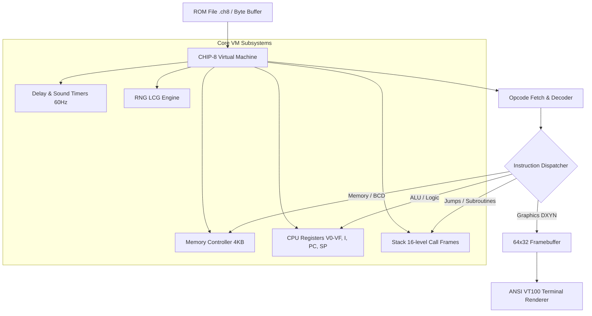

# 👾 DBYTE CHIP-8 Virtual Machine & Emulator

<p align="center">
  
  
  
  
  
</p>

A complete, high-performance **CHIP-8 Virtual Machine, Static Disassembler, and Emulator** written from scratch in **[DByte](https://dbytelang.site/)**.

Built to showcase the byte-level manipulation, memory buffer performance, and systems programming capabilities of DByte v12.

---

## 🌟 Highlights

- **🎯 Full CHIP-8 Instruction Set**: Complete support for all 35 standard CHIP-8 opcodes (Arithmetic, Logic, Flow Control, Stack Calls, Timers, BCD, and Sprite XOR rendering).
- **📺 ANSI ASCII Display**: Crisp 64x32 terminal graphics with real-time rendering, bounding boxes, and status HUD.
- **🔍 Built-in ROM Disassembler**: Static binary analysis tool that parses `.ch8` ROM files and decompiles raw bytecode into formatted Assembly mnemonics.
- **📦 Bundled ROMs**: Built-in IBM Logo, Dynamic Maze Generator, and Starfield demos embedded directly in the source.
- **🧪 Comprehensive Test Suite**: Self-testing CPU diagnostic suite verifying ALU, registers, subroutines, and BCD conversion with deterministic assertions.

---

## 🏗️ Architecture



---

## ⚙️ Hardware Specifications

| Component | Specification | Description |
| :--- | :--- | :--- |
| **Memory** | 4,096 bytes (4 KB) | `0x000-0x1FF`: Reserved & Fontset, `0x200-0xFFF`: Program ROM |
| **Registers** | 16 general-purpose | `V0` to `VF` (8-bit), `VF` doubles as carry/borrow/collision flag |
| **Index Register** | 16-bit (`I`) | Points to memory addresses (`0x000-0xFFF`) |
| **Program Counter** | 16-bit (`PC`) | Starts at `0x0200` (512 decimal) |
| **Stack** | 16 levels | Stores return addresses for nested `CALL` / `RET` instructions |
| **Timers** | 2 × 8-bit | **Delay Timer (DT)** and **Sound Timer (ST)** ticking at 60 Hz |
| **Display** | 64 × 32 monochrome | 2,048 pixels rendered via XOR sprite blitting |
| **Keypad** | 16 keys (Hex) | Keypad mapping `0x0` through `0xF` |

---

## 📋 Opcode Implementation Matrix

<details>
<summary><b>Click to expand full 35-Opcode Coverage Table</b></summary>

| Opcode | Mnemonic | Description | Status |
| :--- | :--- | :--- | :---: |
| `00E0` | `CLS` | Clears the display | ✅ |
| `00EE` | `RET` | Returns from subroutine | ✅ |
| `1NNN` | `JP addr` | Jump to address `NNN` | ✅ |
| `2NNN` | `CALL addr` | Call subroutine at `NNN` | ✅ |
| `3XNN` | `SE Vx, byte` | Skip next instruction if `Vx == NN` | ✅ |
| `4XNN` | `SNE Vx, byte` | Skip next instruction if `Vx != NN` | ✅ |
| `5XY0` | `SE Vx, Vy` | Skip next instruction if `Vx == Vy` | ✅ |
| `6XNN` | `LD Vx, byte` | Set register `Vx = NN` | ✅ |
| `7XNN` | `ADD Vx, byte` | Add `NN` to `Vx` (no carry flag) | ✅ |
| `8XY0` | `LD Vx, Vy` | Set `Vx = Vy` | ✅ |
| `8XY1` | `OR Vx, Vy` | Bitwise OR `Vx \|= Vy` | ✅ |
| `8XY2` | `AND Vx, Vy` | Bitwise AND `Vx &= Vy` | ✅ |
| `8XY3` | `XOR Vx, Vy` | Bitwise XOR `Vx ^= Vy` | ✅ |
| `8XY4` | `ADD Vx, Vy` | Add with Carry: `Vx += Vy`, `VF = carry` | ✅ |
| `8XY5` | `SUB Vx, Vy` | Subtract: `Vx -= Vy`, `VF = NOT borrow` | ✅ |
| `8XY6` | `SHR Vx` | Shift Right: `VF = LSB`, `Vx >>= 1` | ✅ |
| `8XY7` | `SUBN Vx, Vy` | Reverse Subtract: `Vx = Vy - Vx`, `VF = NOT borrow` | ✅ |
| `8XYE` | `SHL Vx` | Shift Left: `VF = MSB`, `Vx <<= 1` | ✅ |
| `9XY0` | `SNE Vx, Vy` | Skip next instruction if `Vx != Vy` | ✅ |
| `ANNN` | `LD I, addr` | Set index register `I = NNN` | ✅ |
| `BNNN` | `JP V0, addr` | Jump to address `NNN + V0` | ✅ |
| `CXNN` | `RND Vx, byte` | Random byte masked with `NN`: `Vx = RND() & NN` | ✅ |
| `DXYN` | `DRW Vx, Vy, N` | Draw `N`-byte sprite at `(Vx, Vy)`, set `VF = collision` | ✅ |
| `EX9E` | `SKP Vx` | Skip next instruction if key in `Vx` is pressed | ✅ |
| `EXA1` | `SKNP Vx` | Skip next instruction if key in `Vx` is NOT pressed | ✅ |
| `FX07` | `LD Vx, DT` | Set `Vx = Delay Timer` | ✅ |
| `FX0A` | `LD Vx, K` | Wait for keypress, store in `Vx` | ✅ |
| `FX15` | `LD DT, Vx` | Set `Delay Timer = Vx` | ✅ |
| `FX18` | `LD ST, Vx` | Set `Sound Timer = Vx` | ✅ |
| `FX1E` | `ADD I, Vx` | Add `Vx` to index register: `I += Vx` | ✅ |
| `FX29` | `LD F, Vx` | Set `I = location of 5-byte sprite for digit Vx` | ✅ |
| `FX33` | `LD B, Vx` | Store BCD representation of `Vx` in `I`, `I+1`, `I+2` | ✅ |
| `FX55` | `LD [I], Vx` | Dump registers `V0` through `Vx` to memory at `I` | ✅ |
| `FX65` | `LD Vx, [I]` | Load registers `V0` through `Vx` from memory at `I` | ✅ |

</details>

---

## 🚀 Quickstart Guide

### Prerequisites
Make sure `dbyte` is installed and available in your `PATH`.
```powershell
dbyte --version
# Output: DByte 12.0.0
```

### 1. Run Built-in Demos
```powershell
# Run IBM Logo Test Demo
dbyte run src/main.dby demo ibm

# Run Dynamic Maze Generator Demo
dbyte run src/main.dby demo maze
```

### 2. Disassemble a ROM File
```powershell
dbyte run src/main.dby disasm roms/maze.ch8
```

Output:
```txt
----------------------------------------------------------------
 DISASSEMBLY OF: roms/maze.ch8
----------------------------------------------------------------
ADDR    HEX     INSTRUCTION
----    ----    -----------
0x0200  00E0    CLS
0x0202  A212    LD I, 0x0212
0x0204  C001    RND V0, 0x01
0x0206  3000    SE V0, 0x00
0x0208  120C    JP 0x020C
0x020A  D121    DRW V1, V2, 1
0x020C  7104    ADD V1, 0x04
0x020E  3140    SE V1, 0x40
0x0210  1204    JP 0x0204
0x0212  6100    LD V1, 0x00
0x0214  7204    ADD V2, 0x04
0x0216  3220    SE V2, 0x20
0x0218  1204    JP 0x0204
0x021A  1200    JP 0x0200
----------------------------------------------------------------
```

### 3. Run Custom External ROM
```powershell
dbyte run src/main.dby run roms/ibm_logo.ch8
```

### 4. Run Automated Test Suite
```powershell
dbyte run tests/test_cpu.dby
```

---

## 📂 Project Structure

```txt
dbyte-chip8-emulator/
├── Dbyte.toml          # DByte package manifest
├── README.md           # Project documentation
├── roms/               # Exported CHIP-8 binary ROMs (.ch8)
│   ├── ibm_logo.ch8
│   ├── maze.ch8
│   └── starfield.ch8
├── src/
│   ├── main.dby        # Application entrypoint & CLI dispatcher
│   ├── chip8.dby       # Core CPU, Memory, & Instruction Execution engine
│   ├── disasm.dby      # Static CHIP-8 Opcode Disassembler
│   ├── display.dby     # 64x32 Framebuffer & ANSI Terminal Renderer
│   ├── keypad.dby      # 16-key Hex Keypad State Manager
│   ├── bits.dby        # Endianness, Hex formatters, & Bitwise ALU helpers
│   └── roms.dby        # Embedded demo ROM binaries
└── tests/
    └── test_cpu.dby    # Automated CPU & Opcode verification suite
```

---

## 📜 License

This project is licensed under the [GPL-2.0 License](LICENSE).
