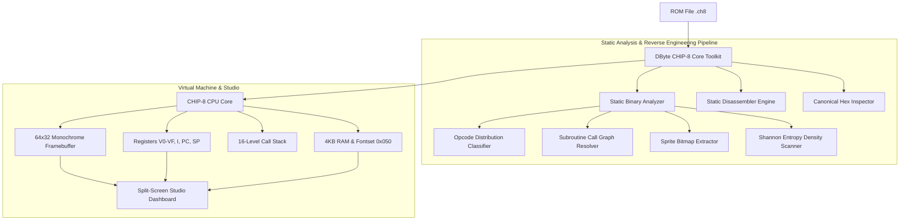

# DByte CHIP-8 Toolchain: Virtual Machine, Binary Static Analyzer & Studio Debugger

<p align="center">
  
  
  
  
  
</p>

An all-in-one **CHIP-8 Virtual Machine, Binary Static Analyzer, Sprite Extractor, Shannon Entropy Scanner, and Split-Screen Studio Debugger** written entirely from scratch in **[DByte](https://dbytelang.site/)**.

Built for low-level systems engineers, emulator developers, and reverse engineering enthusiasts.

---

## Key Features

- **Full Virtual Machine Engine**:
  - Complete support for all 35 CHIP-8 standard opcodes (Flow, Math, Bitwise ALU, Subroutine Call Stack, BCD, Timers, Keypad, Framebuffer XOR).
  - 4KB Address Space with Interpreter fontset mapped at `0x050` and program space starting at `0x0200`.
  - Deterministic Linear Congruential Generator (LCG) for RNG opcodes.
- **Static Binary Analyzer (`inspect`)**:
  - Memory Footprint & Code Size calculation.
  - Opcode class distribution heatmap (Control Flow, Arithmetic, Memory, Display, Misc).
  - Call Target & Subroutine boundary resolver.
  - **Embedded Sprite Bitmap Extractor**: Automatically scans and reconstructs 8xN pixel graphics directly into ASCII previews.
- **Shannon Entropy Density Scanner (`entropy`)**:
  - Exact mathematical Shannon Entropy $H(X) = \log_2(N) - \frac{1}{N}\sum c_i \log_2(c_i)$ calculated via fixed-point logarithmic table.
  - Detects structured data, code, padding, and encrypted/compressed payloads.
- **Split-Screen Studio Debugger (`studio`)**:
  - Real-time CPU register monitor (`V0-VF`, `PC`, `I`, `SP`, `DT`, `ST`, `HALT`).
  - Active instruction execution pipeline showing current opcode and upcoming instruction.
  - Live memory inspector window around `PC`.
  - Downsampled 64x32 monochrome Framebuffer.
- **Static Disassembler (`disasm`)**:
  - Decompiles raw `.ch8` binary files into formatted assembly mnemonics with annotated comments and subroutine labels.
- **Canonical Hex Inspector (`hexdump`)**:
  - Standard 16-byte aligned Hex + ASCII side-by-side terminal inspector.

---

## Architecture



---

## Command Line Interface (CLI) Manual

### 1. Static Binary Analysis & Sprite Extraction
```powershell
dbyte run src/main.dby inspect roms/ibm_logo.ch8
```
Output:
```txt
================================================================================
 [CHIP-8 BINARY STATIC ANALYSIS REPORT]
================================================================================
 Target File:          roms/ibm_logo.ch8
 File Size:            0x0082 ( 130 bytes )
 Memory Footprint:     0x0200 - 0x0282 in CHIP-8 RAM (4096 bytes)
 Execution Entry:      0x0200
 Instruction Count:    65 opcodes

--------------------------------------------------------------------------------
 [OPCODE DISTRIBUTION & METRICS]
--------------------------------------------------------------------------------
  Control Flow (Jumps/Calls/Skips): 5
  ALU / Math / Logic (Add/Xor/Rnd): 5
  Memory & Register Ops (LD/ST/I):  12
  Graphics Rendering (DRW Vx,Vy,N): 6
  System / Timers / Keys / Sound:   37

--------------------------------------------------------------------------------
 [SPRITE BITMAP EXTRACTOR]
--------------------------------------------------------------------------------
  Sprite #0 at RAM 0x022A (Height: F bytes):
    ................
    ................
    ################
    ................
    ################
    ................
    ....########....
    ................
    ....########....
    ................
    ....########....
    ................
    ....########....
    ................
    ################
```

### 2. Clean Emulator Execution
```powershell
dbyte run src/main.dby run roms/ibm_logo.ch8
```
Renders the full 64x32 graphical screen buffer to stdout at completion.

### 3. Split-Screen Studio Debugger
```powershell
# Launch Pong in Studio
dbyte run src/main.dby studio pong

# Launch Brix Breakout in Studio
dbyte run src/main.dby studio brix

# Launch Maze Generator in Studio
dbyte run src/main.dby studio maze
```

### 4. Static Disassembler
```powershell
dbyte run src/main.dby disasm roms/maze.ch8
```

### 5. Shannon Entropy Scan
```powershell
dbyte run src/main.dby entropy roms/pong.ch8
```

### 6. Canonical Hex Dump
```powershell
dbyte run src/main.dby hexdump roms/brix.ch8
```

---

## Automated Test Suites

The project includes two unit test suites:

```powershell
# 1. CPU ALU, Stack, Fontset, and BCD Verification
dbyte run tests/test_cpu.dby

# 2. Shannon Entropy Math, Disassembly & Binary Analysis Verification
dbyte run tests/test_analyzer.dby
```

All tests execute with 100% assertions passed.

---

## Project Structure

```txt
dbyte-chip8-emulator/
├── Dbyte.toml              # DByte Package Manifest
├── README.md               # Documentation & Technical Specifications
├── roms/                   # Built-in Game & Demo ROMs (.ch8)
│   ├── pong.ch8            # Pong (Classic 2-player)
│   ├── brix.ch8            # Brix (Breakout clone)
│   ├── maze.ch8            # Dynamic Maze Generator
│   ├── ibm_logo.ch8        # IBM Logo Graphics Test
│   └── starfield.ch8       # Starfield Demo
├── src/
│   ├── main.dby            # Unified CLI Entrypoint & Dispatcher
│   ├── chip8.dby           # CHIP-8 CPU Core, Memory & Opcode Decoder
│   ├── analyzer.dby        # Binary Static Inspector & Sprite Extractor
│   ├── disasm.dby          # Static Disassembler Engine
│   ├── display.dby         # 64x32 Framebuffer Manager
│   ├── entropy.dby         # Fixed-Point Shannon Entropy Profile Scanner
│   ├── math.dby            # Fixed-Point Logarithmic Table
│   ├── hexdump.dby         # Canonical Hex + ASCII Inspector
│   ├── tui.dby             # Split-Screen Studio Debugger Dashboard
│   ├── keypad.dby          # 16-key Hex Keypad State Manager
│   ├── bits.dby            # Bitwise ALU, Endianness & String Formatter
│   └── roms.dby            # Bundled ROM Byte Array Repository
└── tests/
    ├── test_cpu.dby        # CPU & Instruction Verification Suite
    └── test_analyzer.dby   # Binary Analysis & Entropy Math Verification Suite
```

---

## License

GPL-2.0 License.
