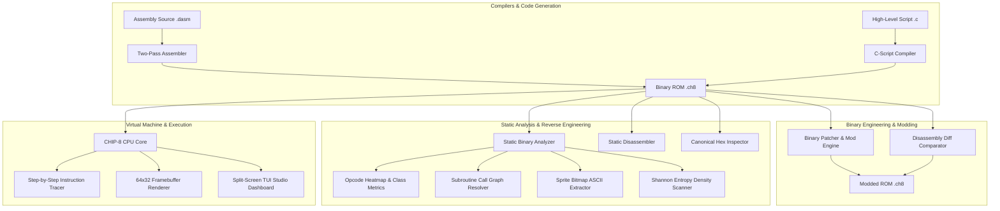

# DByte CHIP-8 SDK & Binary Engineering Toolchain

<p align="center">
  <a href="https://github.com/redcubessockers/dbyte-chip8-emulator/actions"></a>
  <a href="https://dbytelang.site/"></a>
  
  
  
  
  <a href="LICENSE"></a>
</p>

An all-in-one **CHIP-8 Virtual Machine, Compiler SDK, Two-Pass Assembler, High-Level Script Compiler, Instruction Step Tracer, Binary Memory Patcher, Disassembly Diff Engine, and Static Binary Analyzer** written completely from scratch in **[DByte](https://dbytelang.site/)**.

Repository: **[https://github.com/redcubessockers/dbyte-chip8-emulator](https://github.com/redcubessockers/dbyte-chip8-emulator)**

---

## Technical Highlights

- **Full Virtual Machine Engine**: 100% compliant with all 35 CHIP-8 opcodes, 4096-byte memory addressing, 16-level call stack, 60Hz timers, 64x32 monochrome bit-XOR framebuffer, and 16-key keypad matrix.
- **Two-Pass Assembly Compiler (`asm`)**: Compiles human-readable `.dasm` source files into executable `.ch8` binary ROMs.
- **High-Level C-Script Compiler (`compile`)**: Translates structured procedural statements (`CLEAR`, `SET`, `ADD`, `DRAW`, `JUMP`, `CALL`) into optimized machine code.
- **Step-by-Step CPU Tracer (`trace`)**: Single-step execution table monitoring Program Counter (`PC`), current Opcode, disassembled Mnemonic, general-purpose registers (`V0-V7`), Index register (`I`), and Stack Pointer (`SP`).
- **Binary Disassembly Diff Engine (`diff`)**: Compares two binary ROMs side-by-side with full assembly disassembly to detect opcode-level differences.
- **Binary Memory Patcher (`patch`)**: Direct byte-level binary patching engine for game modding, trainer creation, and memory tweaks.
- **Static Binary Analyzer (`inspect`)**: Calculates memory footprints, generates opcode distribution heatmaps, resolves subroutine call graphs, and extracts embedded 8xN bitmap sprites into terminal ASCII previews.
- **Shannon Entropy Scanner (`entropy`)**: Fixed-point discrete Shannon Entropy calculation $H(X) = \log_2(N) - \frac{1}{N}\sum c_i \log_2(c_i)$ to identify code, data tables, padding, and compressed payloads.
- **Cyberpunk Split-Screen TUI Studio (`studio`)**: Live multi-panel terminal dashboard showing real-time registers, CPU pipeline, memory inspect window, and framebuffer.

---

## Architecture Diagram



For in-depth architectural specifications and opcode tables, see [ARCHITECTURE.md](ARCHITECTURE.md).

---

## CLI Command Reference Table

| Command | Syntax | Description |
|---|---|---|
| `asm` | `dbyte run src/main.dby asm <src.dasm> <out.ch8>` | Compiles assembly source to machine bytecode |
| `compile` | `dbyte run src/main.dby compile <src.c> <out.ch8>` | Compiles high-level C-script to machine bytecode |
| `trace` | `dbyte run src/main.dby trace <rom.ch8> [N]` | Step-by-step CPU execution tracer with register watch |
| `diff` | `dbyte run src/main.dby diff <rom1.ch8> <rom2.ch8>` | Side-by-side binary disassembly diff comparator |
| `patch` | `dbyte run src/main.dby patch <rom.ch8> <off> <byte> <out.ch8>` | Patches raw memory byte in ROM binary |
| `inspect` | `dbyte run src/main.dby inspect <rom.ch8>` | Binary static analysis, metrics & sprite extractor |
| `disasm` | `dbyte run src/main.dby disasm <rom.ch8>` | Decompiles `.ch8` binary into assembly mnemonics |
| `run` | `dbyte run src/main.dby run <rom.ch8>` | Clean execution with final 64x32 ASCII Framebuffer |
| `hexdump` | `dbyte run src/main.dby hexdump <rom.ch8>` | Canonical 16-byte aligned Hex + ASCII view |
| `entropy` | `dbyte run src/main.dby entropy <rom.ch8>` | Shannon Entropy density bar chart |
| `studio` | `dbyte run src/main.dby studio [pong\|brix\|maze\|ibm]` | Split-screen Cyberpunk TUI Studio debugger |
| `export` | `dbyte run src/main.dby export` | Exports all bundled ROMs to `roms/` |

---

## Quick Start & Usage Examples

### 1. Compile and Run an Assembly Game (Snake)
```powershell
# Compile assembly source
dbyte run src/main.dby asm examples/snake.dasm roms/snake.ch8

# Trace CPU instructions and watch registers
dbyte run src/main.dby trace roms/snake.ch8 15

# Run in virtual machine
dbyte run src/main.dby run roms/snake.ch8
```

### 2. Compile High-Level Procedural C-Script (Flappy Bird)
```powershell
# Compile high-level C-script
dbyte run src/main.dby compile examples/flappy.c roms/flappy.ch8

# Disassemble the compiled binary
dbyte run src/main.dby disasm roms/flappy.ch8
```

### 3. Binary Static Analysis & Sprite Extraction
```powershell
dbyte run src/main.dby inspect roms/ibm_logo.ch8
```
Example Output:
```txt
================================================================================
 [CHIP-8 BINARY STATIC ANALYSIS REPORT]
================================================================================
 Target File:          roms/ibm_logo.ch8
 File Size:            0x0082 ( 130 bytes )
 Memory Footprint:     0x0200 - 0x0282 in CHIP-8 RAM (4096 bytes)
 Execution Entry:      0x0200
 Instruction Count:    65 opcodes

--------------------------------------------------------------------------------
 [OPCODE DISTRIBUTION & METRICS]
--------------------------------------------------------------------------------
  Control Flow (Jumps/Calls/Skips): 5
  ALU / Math / Logic (Add/Xor/Rnd): 5
  Memory & Register Ops (LD/ST/I):  12
  Graphics Rendering (DRW Vx,Vy,N): 6
  System / Timers / Keys / Sound:   37

--------------------------------------------------------------------------------
 [SPRITE BITMAP EXTRACTOR]
--------------------------------------------------------------------------------
  Sprite #0 at RAM 0x022A (Height: F bytes):
    ................
    ................
    ################
    ................
    ################
    ................
    ....########....
    ................
    ....########....
    ................
    ....########....
    ................
    ....########....
    ................
    ################
```

### 4. Binary Disassembly Diff
```powershell
dbyte run src/main.dby diff roms/maze.ch8 roms/pong.ch8
```

### 5. Binary ROM Patcher & Modding
```powershell
dbyte run src/main.dby patch roms/flappy.ch8 0x03 0x99 roms/flappy_mod.ch8
dbyte run src/main.dby diff roms/flappy.ch8 roms/flappy_mod.ch8
```

### 6. Split-Screen Studio Debugger
```powershell
dbyte run src/main.dby studio pong
```

---

## Automated Test Suites

```powershell
# 1. CPU Core ALU, Fontset, Stack & Instruction Tests
dbyte run tests/test_cpu.dby

# 2. Binary Analyzer & Shannon Entropy Math Tests
dbyte run tests/test_analyzer.dby

# 3. Assembler & Code Generation Tests
dbyte run tests/test_asm.dby
```

All 3 unit test suites pass with 100% assertions.

---

## Project Structure

```txt
dbyte-chip8-emulator/
├── .github/
│   └── workflows/
│       └── ci.yml          # Automated GitHub Actions CI workflow
├── Dbyte.toml              # DByte Package Manifest
├── LICENSE                 # MIT License
├── README.md               # Comprehensive Toolchain Documentation
├── ARCHITECTURE.md         # Technical Architecture & Opcode Matrix
├── examples/               # Example Source Programs
│   ├── snake.dasm          # Snake Game in Assembly
│   ├── pong_game.dasm      # 2-Player Pong in Assembly
│   ├── sprite_invader.dasm # Space Invaders Alien Sprite Demo
│   ├── flappy.c            # Flappy Bird in High-Level C-Script
│   └── demo.dasm           # Minimal Assembly Demo
├── roms/                   # Pre-compiled ROMs (.ch8)
│   ├── pong.ch8            # Pong (Classic 2-player)
│   ├── brix.ch8            # Brix (Breakout clone)
│   ├── maze.ch8            # Dynamic Maze Generator
│   ├── ibm_logo.ch8        # IBM Logo Graphics Test
│   ├── snake.ch8           # Compiled Snake Game
│   ├── flappy.ch8          # Compiled Flappy Bird Demo
│   ├── pong_game.ch8       # Compiled Pong Game
│   ├── sprite_invader.ch8  # Compiled Invader Sprite Demo
│   └── starfield.ch8       # Starfield Particle Demo
├── src/
│   ├── main.dby            # Unified CLI Toolchain Dispatcher
│   ├── asm.dby             # Two-Pass Assembler & Bytecode Generator
│   ├── c_compiler.dby      # High-Level Script Compiler
│   ├── debugger.dby        # Step-by-Step Instruction Tracer
│   ├── patcher.dby         # Binary Patcher & Disassembly Diff Engine
│   ├── chip8.dby           # CHIP-8 CPU Core & Memory Manager
│   ├── analyzer.dby        # Static Binary Inspector & Sprite Extractor
│   ├── disasm.dby          # Static Disassembler Engine
│   ├── display.dby         # 64x32 Monochrome Framebuffer Manager
│   ├── entropy.dby         # Fixed-Point Shannon Entropy Scanner
│   ├── math.dby            # Fixed-Point Logarithmic Table
│   ├── hexdump.dby         # Canonical Hex + ASCII Inspector
│   ├── tui.dby             # Split-Screen Studio Debugger Dashboard
│   ├── keypad.dby          # 16-key Hex Keypad State Manager
│   ├── bits.dby            # Bitwise ALU, Formatter & Parser
│   └── roms.dby            # Bundled ROM Byte Array Repository
└── tests/
    ├── test_cpu.dby        # CPU & ALU Verification Suite
    ├── test_analyzer.dby   # Binary Analysis & Math Suite
    └── test_asm.dby        # Assembler & Code Generation Suite
```

---

## License

MIT License. See [LICENSE](LICENSE) for details.
